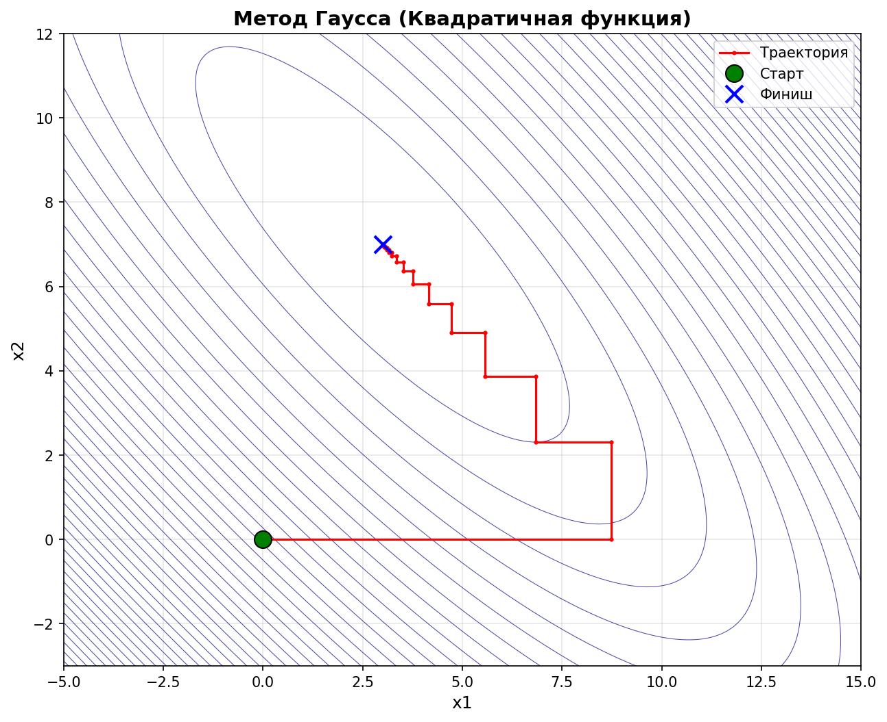
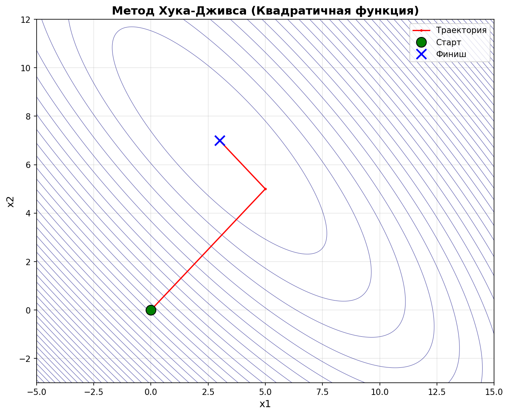
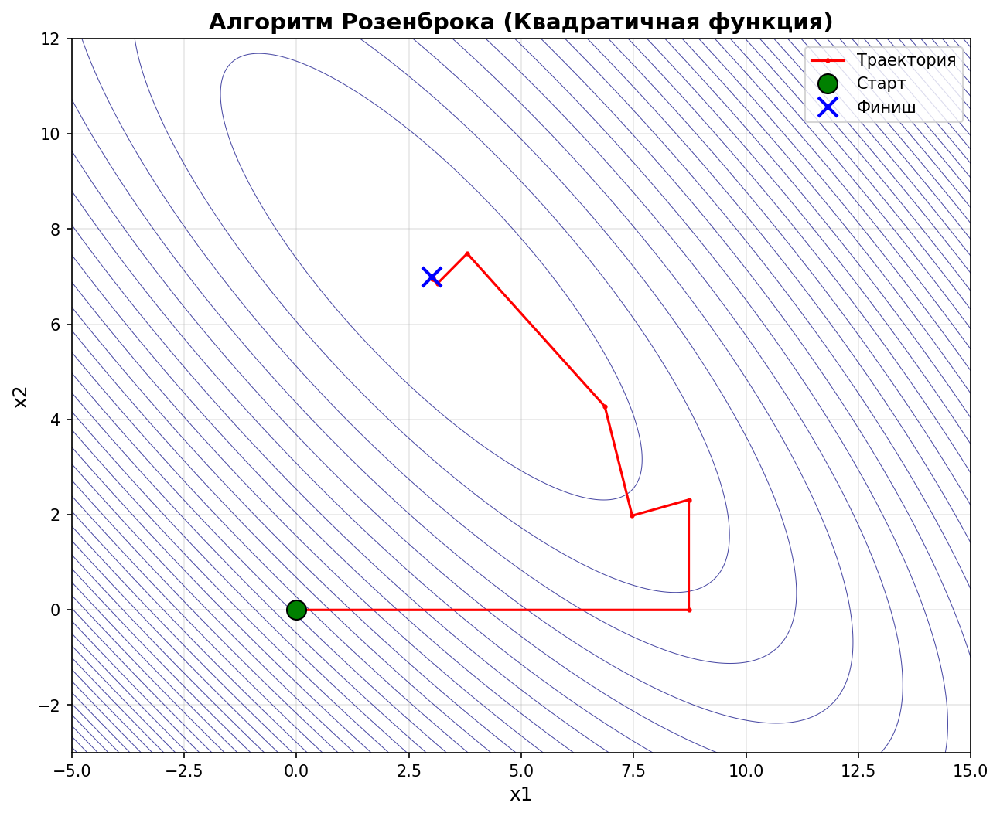
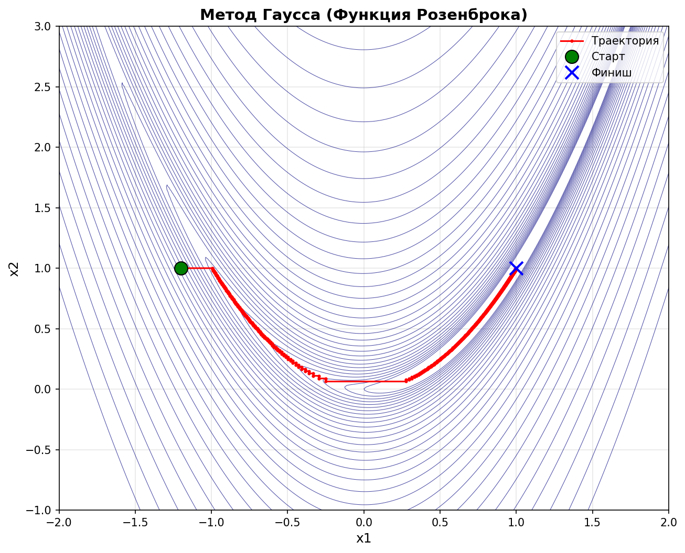
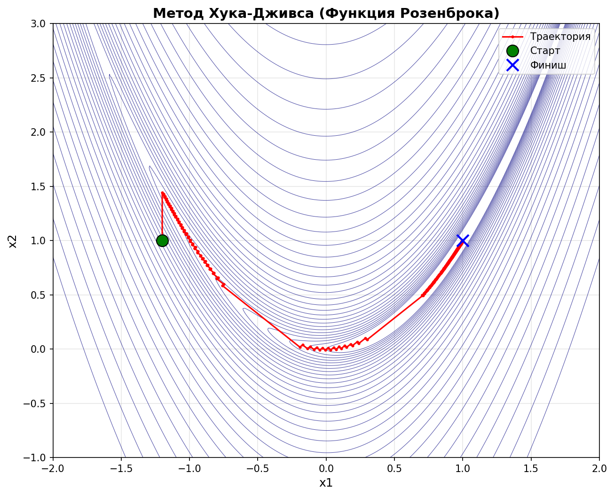
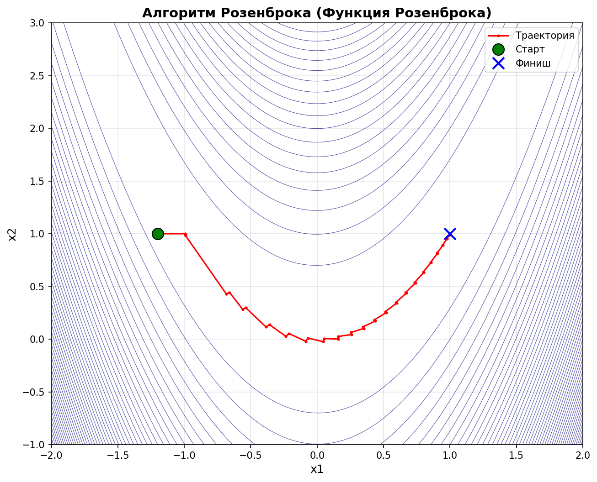

# Лабораторная работа 2

Выполнили: Веселый Д. А.; Ворончук И.И.; Лыкова М.Р.

Группа: ПМИ-32

Вариант: 2

## **Цель**:

Ознакомиться с методами многомерного поиска, используемыми в многомерных методах минимизации функций n переменных. Сравнить различные алгоритмы по эффективности на тестовых примерах.

## **Формулировка задания.**

1. Реализовать методы Гаусса, Хука-Дживса и Розенброка при мининимизации функции $f_1(\overline x)=10(x_1+x_2-10)^2+(x_1-x_2+4)^2,\space \overline{x}^0=[0,0]^T,$ и при минимизации функции Розенброка $f(\overline{x})=100(x_2-x_1^2)^2+(1-x_1)^2,\space \overline x^0=[-1.2,1]^T$.
2. Исследовать сходимость алгоритмов в зависимости от точности используемых методов одномерного поиска.
3. Проанализировать траектории спуска из различных начальных приближений.
4. Отметить достоинства и недостатки методов.
5. Сформулировать выводы.

## Исследование методов при минимизации квадратичной функции
### Метод Гаусса (79 точек)

### Метод Хука-Дживса (3 точки)

### Метод Розенброка (17 точек)

## Исследование методов при минимизации функции Розенброка
### Метод Гаусса (5861 точек)

### Метод Хука-Дживса (4201 точек)

### Метод Розенброка (53 точки)


## 3. Анализ траекторий спуска
### Квадратичная функция

* Метод Гаусса (79 точек) демонстрирует классическое «зигзагообразное» движение вдоль направлений координатных осей. Из-за линейной зависимости направлений спуск происходит достаточно медленно, траектория имеет вид ломаной линии, приближающейся к минимуму 

* Метод Хука-Дживса (3 точки) благодаря исследующему поиску и ускоряющему шагу по образцу быстро находит минимум уже на третьей итерации. Траектория состоит из двух пробных шагов и одного результирующего перемещения прямо в окрестность оптимума.

* Метод Розенброка (17 точек) использует адаптивный поворот системы координат, что позволяет эффективно двигаться вдоль «оврага» квадратичной функции. Траектория более плавная, чем у Гаусса, и требует заметно меньше вычислений функции.

### Функция Розенброка
Эта функция имеет узкий изогнутый овраг, что 3создаёт трудности для многих методов.

* Метод Гаусса (5861 точек) – траектория имеет ярко выраженный пилообразный характер: метод долго «мечется» поперёк оврага, медленно продвигаясь вдоль него. Огромное количество вычислений связано с необходимостью многократного дробления шага.

* Метод Хука-Дживса (4201 точек) – за счёт удачных шагов по образцу иногда удаётся сделать скачок вдоль оврага, но в целом траектория также содержит много зигзагов. Метод сходится быстрее Гаусса, но всё же требует тысяч вычислений.

* Метод Розенброка (53 точки) – благодаря адаптивному повороту координатной системы направления быстро выстраиваются вдоль оврага, и спуск происходит почти прямолинейно. Траектория компактна, метод сходится на два порядка быстрее остальных.

Таким образом, начальные приближения существенно влияют на количество итераций, однако относительная эффективность методов сохраняется: метод Розенброка наиболее устойчив к овражности, Хук-Дживс работает лучше простого покоординатного спуска, а метод Гаусса (покоординатный спуск) оказывается самым медленным на сложном рельефе.


## 4. Достоинства и недостатки методов
### Метод Гаусса (покоординатный спуск)
Достоинства:
* Простота реализации и понимания.
* Не требует вычисления производных.
* Гарантированно сходится для гладких функций  (при точном одномерном поиске).

Недостатки:
* Крайне низкая скорость сходимости на овражных функциях (множество итераций).
* Траектория имеет зигзагообразный характер, особенно вблизи минимума.
* Эффективность сильно зависит от выбора системы координат.

## Метод Хука-Дживса
Достоинства:
* Комбинация исследующего поиска и ускоряющих шагов по образцу позволяет быстрее двигаться в перспективных направлениях.
* Прост в реализации, не требует производных.
* На гладких квадратичных функциях сходится за малое число итераций.
Недостатки:
* На овражных функциях всё ещё требуется много вычислений (хотя меньше, чем у Гаусса).
* Возможны зацикливания или неэффективные шаги при неудачном выборе параметров.
* Зависимость от точности одномерного поиска.

## Метод Розенброка
Достоинства:
* Адаптивный поворот системы координат позволяет выстраивать направления вдоль оврага, что обеспечивает высокую скорость сходимости (близкую к сверхлинейной) даже на сильно вытянутых функциях.
* Не требует производных, работает только с направлениями.
* Показывает наилучшие результаты на функции Розенброка (наименьшее число вычислений).

Недостатки:
* sБолее сложная реализация (необходимо ортогонализировать направления после каждой итерации).
* sНа некоторых функциях может «застревать» или требовать перезапуска.
* sЧувствителен к параметрам (начальный шаг, коэффициент уменьшения шага).

## 5. Выводы
На основании проведённого исследования можно рекомендовать метод Розенброка для решения задач с овражной структурой, метод Хука-Дживса – как компромисс между простотой и эффективностью, а метод Гаусса – лишь для хорошо масштабированных функций или в учебных целях.

## Приложение
Код прорграммы (python):
```python
import numpy as np
import matplotlib.pyplot as plt
import os
from scipy.optimize import minimize_scalar

SCRIPT_DIR = os.path.dirname(os.path.abspath(__file__))
SAVE_DIR = os.path.join(SCRIPT_DIR, 'plots')
os.makedirs(SAVE_DIR, exist_ok=True)

# --- 1. Тестовые функции ---

def quadratic_func(x):
    """f(x) = 10*(x1 + x2 - 10)^2 + (x1 - x2 + 4)^2  ->  min в (3, 7)"""
    return 10 * (x[0] + x[1] - 10)**2 + (x[0] - x[1] + 4)**2

def rosenbrock_func(x):
    """f(x) = 100*(x2 - x1^2)^2 + (1 - x1)^2  ->  min в (1, 1)"""
    return 100 * (x[1] - x[0]**2)**2 + (1 - x[0])**2

# --- 2. Одномерный поиск (С брекетингом для защиты от перескоков) ---

def bracket_unimodal(phi, start_step=1e-4, max_iter=1000):
    lam0 = 0.0
    f0 = phi(lam0)
    
    # Делаем пробные шаги вперед и назад
    f1 = phi(start_step)
    f_minus1 = phi(-start_step)
    
    # Определяем направление убывания функции
    if f1 < f0:
        h = start_step
        lam1 = start_step
        f1 = f1
    elif f_minus1 < f0:
        h = -start_step
        lam1 = -start_step
        f1 = f_minus1
    else:
        # Если в обе стороны функция растет, то мы уже близко к минимуму
        return (-start_step, start_step)
        
    lam_prev = lam0
    lam_curr = lam1
    f_curr = f1
    
    # Шагаем с удвоением шага, пока функция убывает
    for _ in range(max_iter):
        h *= 2.0
        lam_next = lam_curr + h
        f_next = phi(lam_next)
        
        if f_next >= f_curr:
            # Нашли точку разворота (функция начала расти). Возвращаем упорядоченные границы.
            if h > 0:
                return (lam_prev, lam_next)
            else:
                return (lam_next, lam_prev)
                
        lam_prev = lam_curr
        lam_curr = lam_next
        f_curr = f_next
        
    # Страховка на случай достижения лимита итераций
    if h > 0:
        return (lam_prev, lam_curr + h)
    else:
        return (lam_curr + h, lam_prev)

def line_search(func, x, direction, tol=1e-8):
    """Минимизация f(x + lam*d) по lam."""
    def phi(lam):
        return func(x + lam * direction)
        
    # 1. Выделяем надежный интервал унимодальности (не пускаем алгоритм за хребет)
    bracket = bracket_unimodal(phi)
    
    # 2. Ищем минимум строго внутри найденного интервала (метод bounded)
    result = minimize_scalar(phi, method='bounded', bounds=bracket, options={'xatol': tol})
    return result.x

# --- 3. Метод Гаусса (координатный спуск) ---

def method_gauss(func, x0, tol=1e-6, max_iter=5000):
    x = np.array(x0, dtype=float)
    n = len(x)
    history = [x.copy()]

    for k in range(max_iter):
        x_old = x.copy()
        for i in range(n):
            d = np.zeros(n)
            d[i] = 1.0
            lam = line_search(func, x, d)
            x = x + lam * d
            history.append(x.copy())

        if np.linalg.norm(x - x_old) < tol and abs(func(x) - func(x_old)) < tol:
            break

    return x, func(x), history

# --- 4. Метод Хука–Дживса ---

def method_hooke_jeeves(func, x0, step=1.0, step_reduce=0.5, tol=1e-8, max_iter=10000):
    x = np.array(x0, dtype=float)
    n = len(x)
    history = [x.copy()]
    iters = 0

    while step > tol and iters < max_iter:
        x_new = x.copy()
        for i in range(n):
            f_cur = func(x_new)
            x_try = x_new.copy()
            x_try[i] += step
            if func(x_try) < f_cur:
                x_new = x_try
            else:
                x_try = x_new.copy()
                x_try[i] -= step
                if func(x_try) < f_cur:
                    x_new = x_try

        if func(x_new) < func(x):
            direction = x_new - x
            lam = line_search(func, x, direction)
            x = x + lam * direction
            history.append(x.copy())
            iters += 1
        else:
            step *= step_reduce

    return x, func(x), history

# --- 5. Алгоритм Розенброка ---

def gram_schmidt(vecs):
    """Ортогонализация Грама–Шмидта."""
    n = len(vecs)
    basis =[]
    for i, v in enumerate(vecs):
        w = v.copy()
        for b in basis:
            w = w - np.dot(w, b) * b
        nrm = np.linalg.norm(w)
        if nrm > 1e-12:
            basis.append(w / nrm)
        else:
            e = np.zeros(n)
            for idx in range(n):
                e = np.zeros(n)
                e[idx] = 1.0
                w2 = e.copy()
                for b in basis:
                    w2 = w2 - np.dot(w2, b) * b
                nrm2 = np.linalg.norm(w2)
                if nrm2 > 1e-12:
                    basis.append(w2 / nrm2)
                    break
    return np.array(basis)

def method_rosenbrock_alg(func, x0, tol=1e-8, max_iter=500):
    x = np.array(x0, dtype=float)
    n = len(x)
    S = np.eye(n)
    history =[x.copy()]

    for k in range(max_iter):
        x_start = x.copy()
        lambdas = np.zeros(n)

        for i in range(n):
            lam = line_search(func, x, S[i])
            lambdas[i] = lam
            x = x + lam * S[i]
            history.append(x.copy())

        if np.linalg.norm(x - x_start) < tol and abs(func(x) - func(x_start)) < tol:
            break

        A = np.array([
            sum(lambdas[j] * S[j] for j in range(i, n))
            for i in range(n)
        ])

        if np.linalg.norm(A[0]) < 1e-12:
            S = np.eye(n)
            continue

        S_new = gram_schmidt(A)

        if S_new.shape == (n, n):
            S = S_new
        else:
            S = np.eye(n)

    return x, func(x), history

# --- 6. Визуализация ---

def plot_trajectory(func, history, title, xlim, ylim, filename, save=True, show=False):
    fig, ax = plt.subplots(figsize=(10, 8))

    x1 = np.linspace(xlim[0], xlim[1], 300)
    x2 = np.linspace(ylim[0], ylim[1], 300)
    X1, X2 = np.meshgrid(x1, x2)
    Z = func([X1, X2])

    levels = np.logspace(0, 3, 30) if 'Розенброка' in title and 'Алгоритм' not in title.split('(')[0] else None
    if levels is None:
        levels = 50

    ax.contour(X1, X2, Z, levels=levels, colors='navy', linewidths=0.5, alpha=0.7)

    hist_arr = np.array(history)
    ax.plot(hist_arr[:, 0], hist_arr[:, 1], 'r.-', label='Траектория', linewidth=1.5, markersize=4)
    ax.plot(hist_arr[0, 0], hist_arr[0, 1], 'go', label='Старт', markersize=12, markeredgecolor='black')
    ax.plot(hist_arr[-1, 0], hist_arr[-1, 1], 'bx', label='Финиш', markersize=12, markeredgewidth=2)

    ax.set_title(title, fontsize=14, fontweight='bold')
    ax.set_xlabel('x1', fontsize=12)
    ax.set_ylabel('x2', fontsize=12)
    ax.legend(loc='best', fontsize=10)
    ax.grid(True, alpha=0.3)
    ax.set_xlim(xlim)
    ax.set_ylim(ylim)

    if save:
        save_path = os.path.join(SAVE_DIR, filename)
        plt.savefig(save_path, dpi=150, bbox_inches='tight', facecolor='white')
        print(f"✓ Сохранён: {save_path}")

    if show:
        plt.show()
    else:
        plt.close()

# --- 7. Запуск ---

def run_experiments():
    print("=" * 60)
    print("МИНИМИЗАЦИЯ ФУНКЦИЙ")
    print("=" * 60)

    x0_quad = [0.0, 0.0]
    x0_ros  = [-1.2, 1.0]

    # ── Квадратичная функция ──────────────────────────────────────
    print("\n--- Квадратичная функция (минимум в[3, 7]) ---")

    x_g,  f_g,  h_g  = method_gauss(quadratic_func, x0_quad)
    x_hj, f_hj, h_hj = method_hooke_jeeves(quadratic_func, x0_quad)
    x_r,  f_r,  h_r  = method_rosenbrock_alg(quadratic_func, x0_quad)

    print(f"Гаусс:       x={np.round(x_g,  4)},  f={f_g:.2e},  точек={len(h_g)}")
    print(f"Хук–Дживс:   x={np.round(x_hj, 4)},  f={f_hj:.2e},  точек={len(h_hj)}")
    print(f"Розенброк:   x={np.round(x_r,  4)},  f={f_r:.2e},  точек={len(h_r)}")

    # ── Функция Розенброка ────────────────────────────────────────
    print("\n--- Функция Розенброка (минимум в [1, 1]) ---")

    x_g_r,  f_g_r,  h_g_r  = method_gauss(rosenbrock_func, x0_ros)
    x_hj_r, f_hj_r, h_hj_r = method_hooke_jeeves(rosenbrock_func, x0_ros)
    x_r_r,  f_r_r,  h_r_r  = method_rosenbrock_alg(rosenbrock_func, x0_ros)

    print(f"Гаусс:       x={np.round(x_g_r,  4)},  f={f_g_r:.2e},  точек={len(h_g_r)}")
    print(f"Хук–Дживс:   x={np.round(x_hj_r, 4)},  f={f_hj_r:.2e},  точек={len(h_hj_r)}")
    print(f"Розенброк:   x={np.round(x_r_r,  4)},  f={f_r_r:.2e},  точек={len(h_r_r)}")

    print("\n" + "=" * 60)
    print("СОХРАНЕНИЕ ГРАФИКОВ")
    print("=" * 60)

    plot_trajectory(quadratic_func, h_g, "Метод Гаусса (Квадратичная функция)", xlim=(-5, 15), ylim=(-3, 12), filename="trajectory_gauss_quadratic.png")
    plot_trajectory(quadratic_func, h_hj, "Метод Хука-Дживса (Квадратичная функция)", xlim=(-5, 15), ylim=(-3, 12), filename="trajectory_hooke_jeeves_quadratic.png")
    plot_trajectory(quadratic_func, h_r, "Алгоритм Розенброка (Квадратичная функция)", xlim=(-5, 15), ylim=(-3, 12), filename="trajectory_rosenbrock_alg_quadratic.png")

    plot_trajectory(rosenbrock_func, h_g_r, "Метод Гаусса (Функция Розенброка)", xlim=(-2, 2), ylim=(-1, 3), filename="trajectory_gauss_rosenbrock.png")
    plot_trajectory(rosenbrock_func, h_hj_r, "Метод Хука-Дживса (Функция Розенброка)", xlim=(-2, 2), ylim=(-1, 3), filename="trajectory_hooke_jeeves_rosenbrock.png")
    plot_trajectory(rosenbrock_func, h_r_r, "Алгоритм Розенброка (Функция Розенброка)", xlim=(-2, 2), ylim=(-1, 3), filename="trajectory_rosenbrock_alg_rosenbrock.png")

    print("\nГОТОВО! Все 6 графиков сохранены в папку plots/")

if __name__ == "__main__":
    run_experiments()
```