# Лабораторная работа 3

Выполнили: Веселый Д. А.; Ворончук И.И.; Лыкова М.Р.

Группа: ПМИ-32

Вариант: 2

## **Цель**:

Ознакомиться с методами оптимизации первого порядка, использующими градиент целевой функции. Сравнить различные алгоритмы по эффективности на тестовых примерах.

## **Формулировка задания.**

1. Реализовать методы наискорейшего спуска, сопряжённых градиентов и переменной метрики при минимизации квадратичной функции $f_1(\overline x)=10(x_1+x_2-10)^2+(x_1-x_2+4)^2,\space \overline{x}^0=[0,0]^T,$ и при минимизации функции Розенброка $f(\overline{x})=100(x_2-x_1^2)^2+(1-x_1)^2,\space \overline x^0=[-1.2,1]^T$.
2. На квадратичной функции исследовать сходимость алгоритмов в зависимости от точности используемого метода одномерного поиска. Оценить затраты (число итераций, количество вычислений минимизируемой функции, влияние начального приближения). Сравнить метод Флетчера–Ривса и Полака–Рибьера. Сравнить метод Бройдена с методом Дэвидона–Флетчера–Пауэлла (DFP). Сравнить метод Флетчера–Ривса с методом Бройдена.
3. Сравнить результативность методов на функции Розенброка.
4. Сформулировать выводы, отметить достоинства и недостатки методов.

## Исследование методов при минимизации квадратичной функции
### Наискорейший спуск (9 итераций)
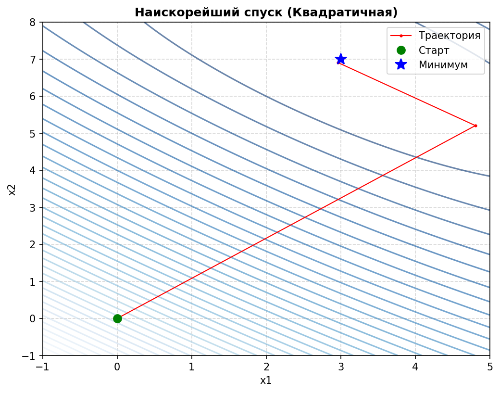
### Сопряжённые градиенты (Флетчер-Ривс) (3 итерации)
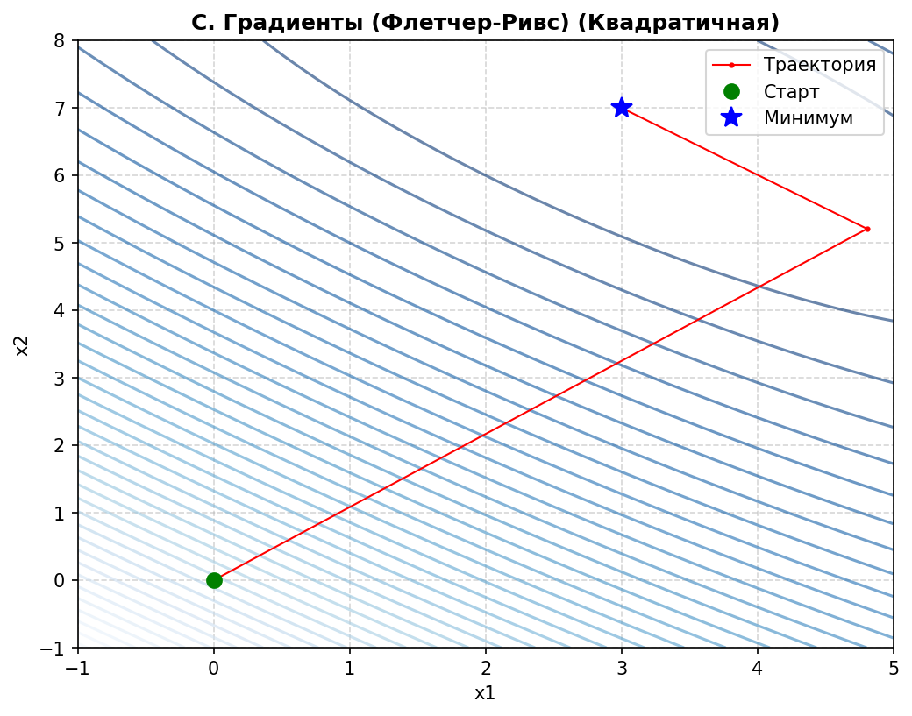
### Сопряжённые градиенты (Полак-Рибьер) (3 итерации)

### Переменная метрика (Бройден) (3 итерации)
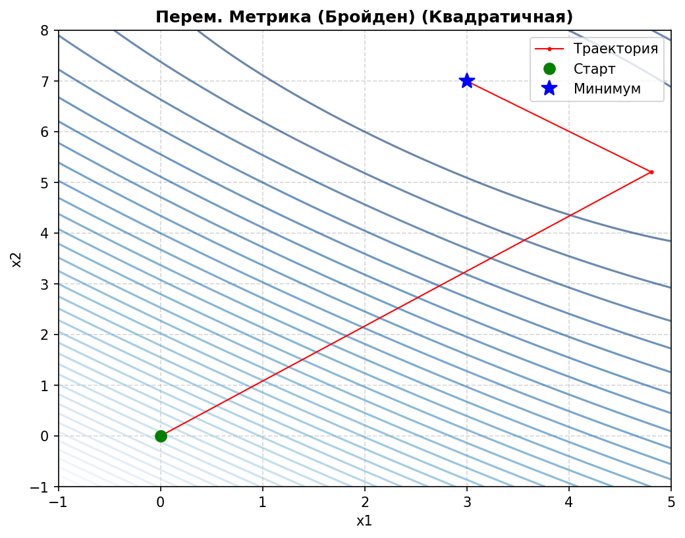
### Переменная метрика (DFP) (3 итерации)
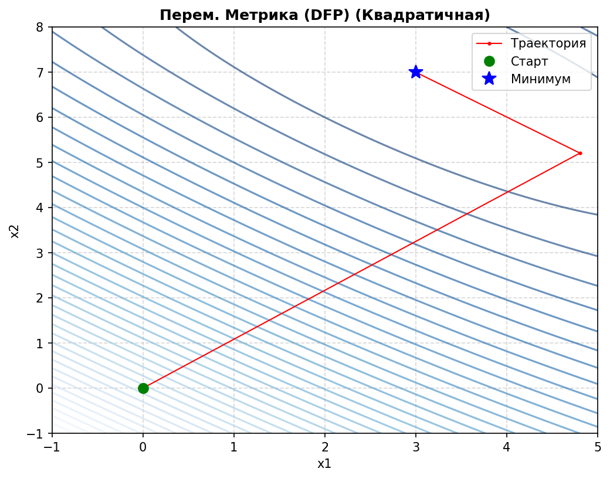

## Исследование методов при минимизации функции Розенброка
### Наискорейший спуск (5000 итераций)
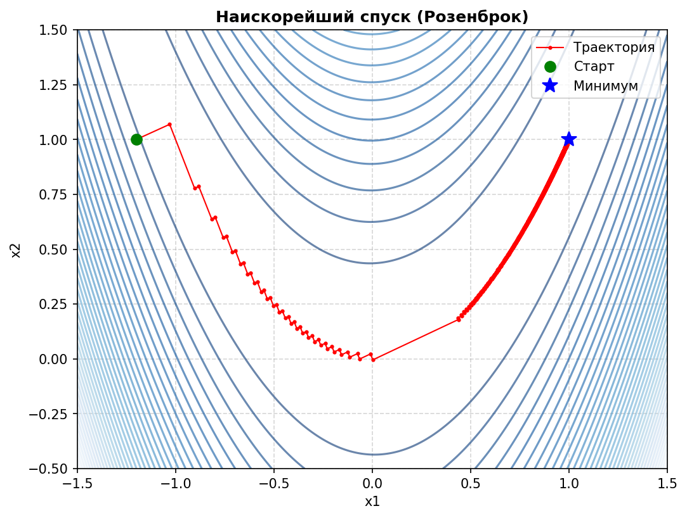
### Сопряжённые градиенты (Флетчер-Ривс) (36 итераций)

### Сопряжённые градиенты (Полак-Рибьер) (34 итерации)
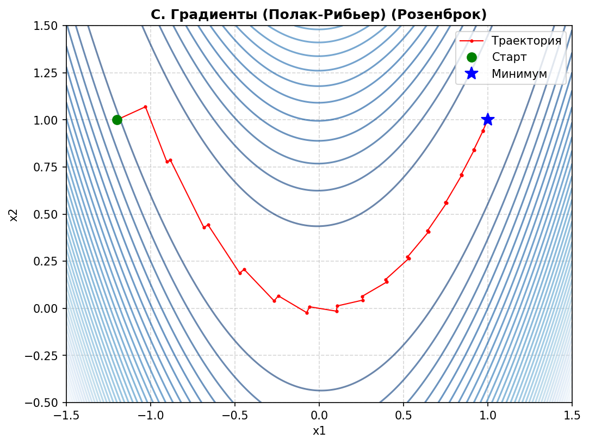
### Переменная метрика (Бройден) (18 итераций)
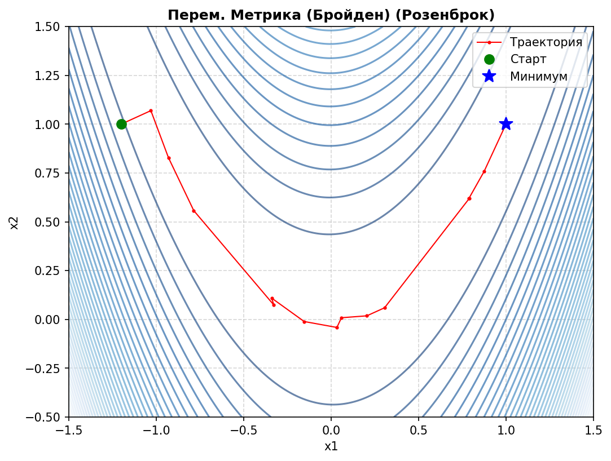
### Переменная метрика (DFP) (22 итерации)
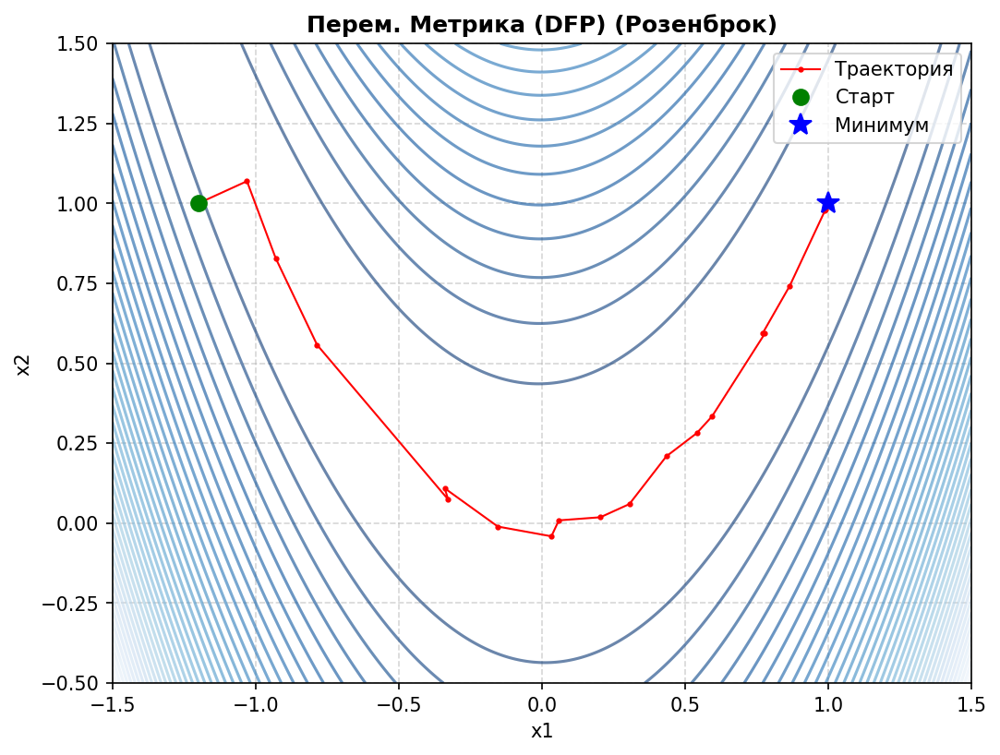

## Исследование сходимости в зависимости от точности одномерного поиска
### Наискорейший спуск (грубый поиск, ls_tol = 0.1) (61 итерация)
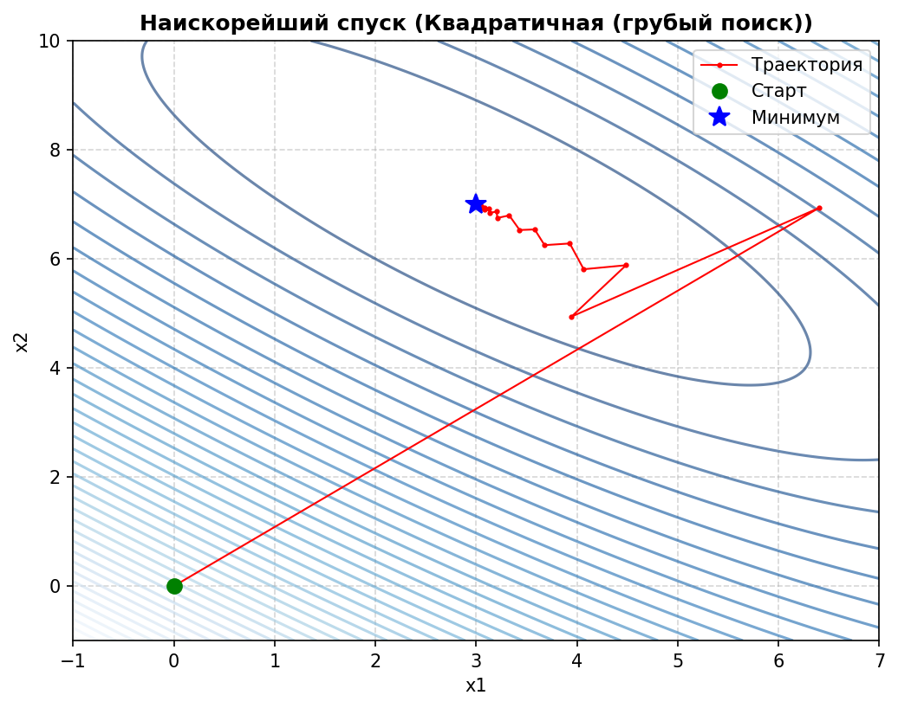
### Сопряжённые градиенты (Флетчер-Ривс) (грубый поиск) (19 итераций)
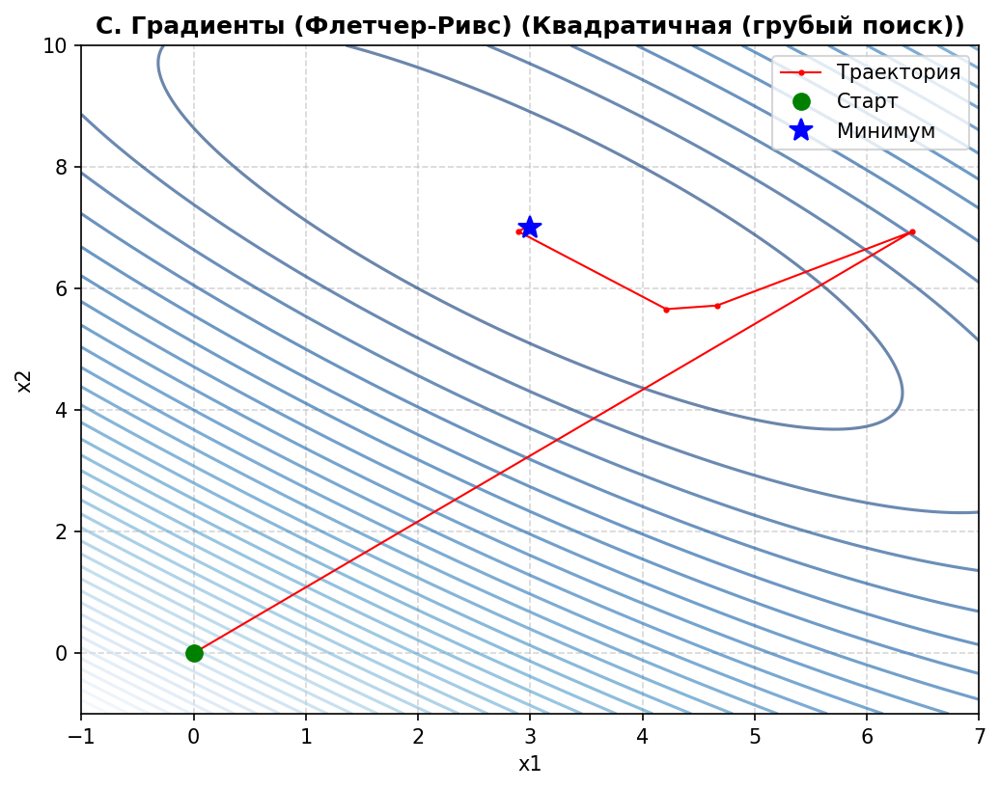
### Сопряжённые градиенты (Полак-Рибьер) (грубый поиск) (30 итераций)
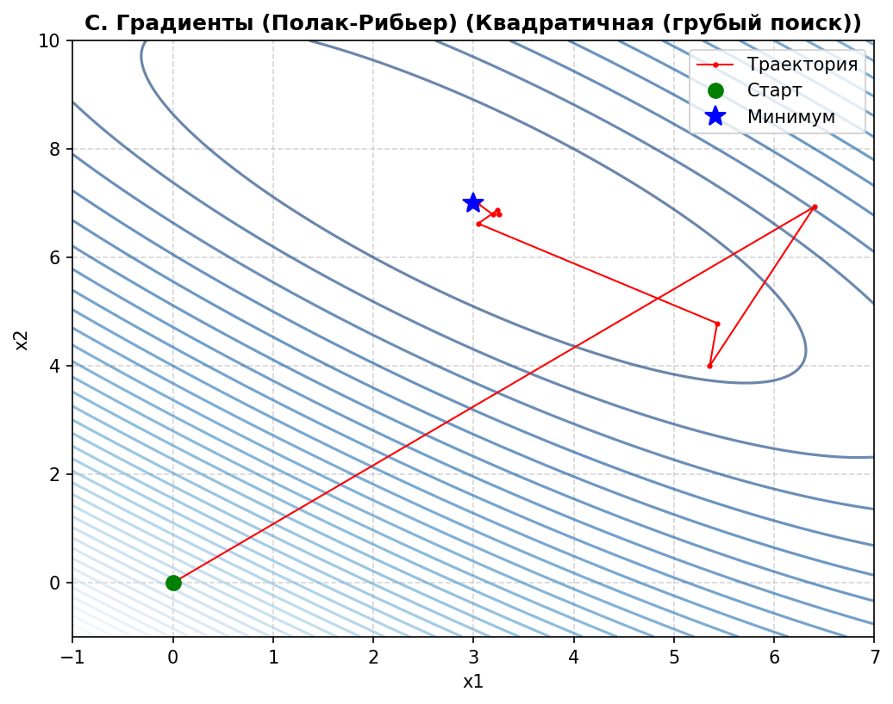
### Переменная метрика (Бройден) (грубый поиск) (4 итерации)
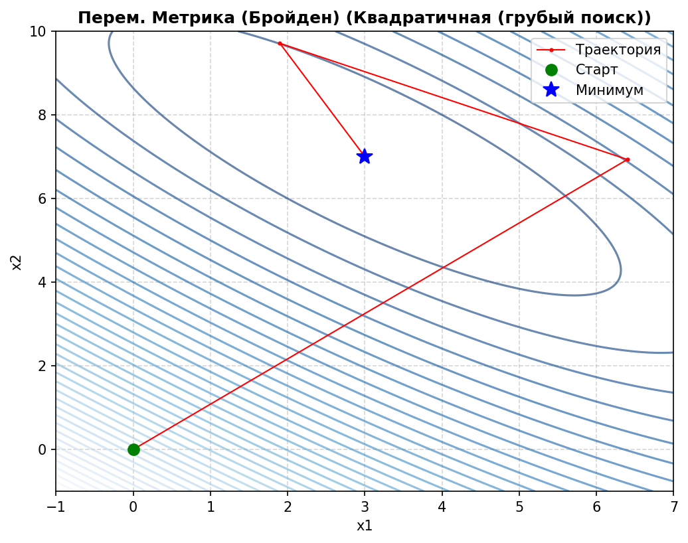
### Переменная метрика (DFP) (грубый поиск) (5 итераций)
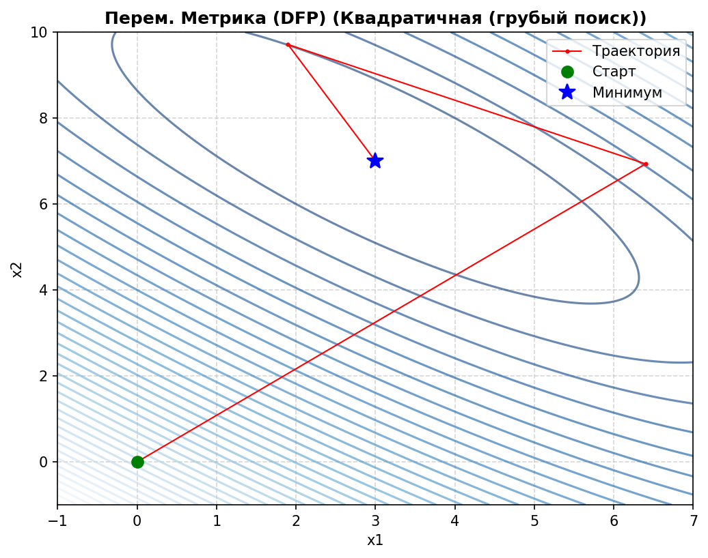

## 3. Анализ траекторий спуска и сравнение методов
### Квадратичная функция (точный поиск, ls_tol = 1e-5)

* **Наискорейший спуск** (9 итераций, 132 вычисления функции, 9 вычислений градиента) — демонстрирует классическое движение с ортогональными шагами: каждое новое направление спуска перпендикулярно предыдущему, поскольку шаг выбирается из условия точной одномерной минимизации. Траектория имеет зигзагообразный характер, особенно вблизи минимума. Метод требует значительно больше вычислений функции из-за необходимости многократного уточнения шага на каждой итерации.

* **Сопряжённые градиенты (Флетчер-Ривс)** (3 итерации, 33 вычисления функции, 3 вычисления градиента) — благодаря свойству сопряжённости направлений метод находит минимум квадратичной функции ровно за n = 2 итерации (плюс одна начальная). Траектория значительно прямее, чем у наискорейшего спуска, и не содержит избыточных зигзагов. Число вычислений функции и градиента минимально.

* **Сопряжённые градиенты (Полак-Рибьер)** (3 итерации, 33 вычисления функции, 3 вычисления градиента) — показывает идентичные результаты на квадратичной функции, поскольку для квадратичных функций оба метода (Флетчер-Ривс и Полак-Рибьер) теоретически эквивалентны и дают одинаковые коэффициенты ω_k.

* **Переменная метрика (Бройден)** (3 итерации, 33 вычисления функции, 5 вычислений градиента) — метод также сходится за 3 итерации, строя аппроксимацию обратной матрицы Гессе. Направления поиска становятся сопряжёнными относительно матрицы вторых производных. Требует немного больше вычислений градиента из-за необходимости обновления матрицы H_k.

* **Переменная метрика (DFP)** (3 итерации, 33 вычисления функции, 5 вычислений градиента) — метод Дэвидона-Флетчера-Пауэлла показывает аналогичную сходимость, используя иную формулу обновления матрицы. Оба метода переменной метрики демонстрируют сверхлинейную скорость сходимости на квадратичной функции.

### Функция Розенброка
Эта функция имеет узкий изогнутый овраг, что создаёт серьёзные трудности для методов оптимизации.

* **Наискорейший спуск** (5000 итераций, 55836 вычислений функции, 5000 вычислений градиента) — метод показывает наихудшие результаты: траектория имеет ярко выраженный зигзагообразный характер, метод «мечется» поперёк оврага, крайне медленно продвигаясь вдоль него. Огромное количество вычислений функции связано с необходимостью многократного уточнения шага в узком овраге. Метод не смог достичь требуемой точности за отведанное число итераций.

* **Сопряжённые градиенты (Флетчер-Ривс)** (36 итераций, 577 вычислений функции, 36 вычислений градиента) — метод сходится значительно быстрее наискорейшего спуска благодаря использованию сопряжённых направлений. Однако на неквадратичной функции свойство сопряжённости нарушается, и метод требует периодической перезапуска направления.

* **Сопряжённые градиенты (Полак-Рибьер)** (34 итерации, 532 вычисления функции, 34 вычисления градиента) — показывает немного лучшие результаты, чем метод Флетчера-Ривса: формула Полака-Рибьера лучше адаптируется к локальной кривизне функции, что позволяет сократить число итераций и вычислений.

* **Переменная метрика (Бройден)** (18 итераций, 379 вычислений функции, 35 вычислений градиента) — наилучший результат среди всех методов. Аппроксимация обратной матрицы Гессе позволяет эффективно учитывать кривизну функции и выстраивать направления вдоль оврага. Траектория компактна и почти прямолинейна вблизи минимума.

* **Переменная метрика (DFP)** (22 итерации, 512 вычислений функции, 43 вычисления градиента) — также показывает высокую эффективность, хотя и уступает методу Бройдена на данной функции. Разница в формулах обновления матрицы приводит к несколько большему числу итераций и вычислений.

### Влияние точности одномерного поиска (квадратичная функция)

При уменьшении точности одномерного поиска (ls_tol = 0.1 вместо 1e-5):

| Метод                          | Итерации (точно) | Итерации (грубо) | Изменение |
|--------------------------------|------------------|------------------|-----------|
| Наискорейший спуск             | 9                | 61               | +579%     |
| С. градиенты (Флетчер-Ривс)    | 3                | 19               | +533%     |
| С. градиенты (Полак-Рибьер)    | 3                | 30               | +900%     |
| Перем. метрика (Бройден)       | 3                | 4                | +33%      |
| Перем. метрика (DFP)           | 3                | 5                | +67%      |

**Вывод:** Методы переменной метрики значительно более устойчивы к снижению точности одномерного поиска, поскольку матрица H_k адаптируется к локальной геометрии функции и компенсирует неточность выбора шага. Методы сопряжённых градиентов и наискорейшего спуска критически зависят от точности одномерной минимизации.

## 4. Достоинства и недостатки методов
### Наискорейший спуск
**Достоинства:**
* Простота реализации и понимания.
* Не требует хранения дополнительной информации (кроме градиента).
* Гарантированно сходится для гладких выпуклых функций.

**Недостатки:**
* Крайне низкая скорость сходимости на овражных функциях.
* Траектория имеет зигзагообразный характер, особенно вблизи минимума.
* Требует очень точного одномерного поиска для эффективной работы.
* Число итераций растёт экспоненциально с увеличением обусловленности функции.

### Методы сопряжённых градиентов (Флетчер-Ривс, Полак-Рибьер)
**Достоинства:**
* Для квадратичных функций гарантированно сходятся за n итераций.
* Не требуют вычисления и хранения матрицы вторых производных.
* Занимают промежуточное положение по сложности между градиентным спуском и методами Ньютона.
* На функциях с умеренной овражностью показывают хорошую сходимость.

**Недостатки:**
* На неквадратичных функциях требуют периодической перезапуска направления.
* Метод Флетчера-Ривса может быть менее устойчив при отклонении функции от квадратичной.
* Метод Полака-Рибьера требует ограничения ω_k ≥ 0 для гарантии сходимости.
* Оба метода чувствительны к точности одномерного поиска.

### Методы переменной метрики (Бройден, DFP)
**Достоинства:**
* Строят аппроксимацию обратной матрицы Гессе, что обеспечивает сверхлинейную скорость сходимости.
* Наилучшие результаты на овражных функциях (функция Розенброка).
* Метод Бройдена показал наилучшую устойчивость к снижению точности одномерного поиска.
* Не требуют вычисления вторых производных явно.

**Недостатки:**
* Более сложная реализация (необходимость обновления матрицы H_k).
* Требуют хранения матрицы n×n, что может быть затратно для больших n.
* Необходимость поддержания положительной определённости матрицы H_k.
* Чувствительны к численной устойчивости формул обновления.

## 5. Выводы
На основании проведённого исследования можно сделать следующие выводы:

1. **На квадратичных функциях** все методы второго порядка (сопряжённые градиенты и переменной метрики) сходятся за минимальное число итераций (n+1 для n-мерной задачи). Метод наискорейшего спуска требует значительно больше итераций из-за зигзагообразной траектории.

2. **На овражных функциях** (Розенброка) методы переменной метрики показывают наилучшие результаты: метод Бройдена — 18 итераций, DFP — 22 итерации. Методы сопряжённых градиентов требуют в 2 раза больше итераций, а наискорейший спуск практически неработоспособен (5000 итераций без достижения точности).

3. **Сравнение методов сопряжённых градиентов**: метод Полака-Рибьера показывает небольшое преимущество над методом Флетчера-Ривса на неквадратичных функциях благодаря лучшей адаптации к локальной кривизне.

4. **Сравнение методов переменной метрики**: метод Бройдена превзошёл метод DFP на функции Розенброка как по числу итераций, так и по общему числу вычислений функции и градиента.

5. **Влияние точности одномерного поиска**: методы переменной метрики значительно более устойчивы к снижению точности line search, что делает их более предпочтительными в ситуациях, когда точная одномерная минимизация затруднена или дорога.

На основании проведённого исследования можно рекомендовать методы переменной метрики (особенно метод Бройдена) для решения задач с овражной структурой, методы сопряжённых градиентов (предпочтительно Полака-Рибьера) — как компромисс между простотой и эффективностью для задач умеренной размерности, а метод наискорейшего спуска — лишь для хорошо масштабированных функций или в учебных целях.

## Приложение
Код программы (Python):
```python
import numpy as np
import matplotlib.pyplot as plt
from scipy.optimize import minimize_scalar
import os

SCRIPT_DIR = os.path.dirname(os.path.abspath(__file__))
SAVE_DIR = os.path.join(SCRIPT_DIR, 'plots_task_1_2')
os.makedirs(SAVE_DIR, exist_ok=True)

def f_quad(x):
    """Целевая квадратичная функция (минимум в 3, 7)"""
    x1, x2 = x[0], x[1]
    return 10 * (x1 + x2 - 10)**2 + (x1 - x2 + 4)**2

def grad_quad(x):
    x1, x2 = x[0], x[1]
    df_dx1 = 20 * (x1 + x2 - 10) + 2 * (x1 - x2 + 4)
    df_dx2 = 20 * (x1 + x2 - 10) - 2 * (x1 - x2 + 4)
    return np.array([df_dx1, df_dx2])

def f_rosen(x):
    """Функция Розенброка (минимум в 1, 1)"""
    x1, x2 = x[0], x[1]
    return 100 * (x2 - x1**2)**2 + (1 - x1)**2

def grad_rosen(x):
    x1, x2 = x[0], x[1]
    df_dx1 = -400 * x1 * (x2 - x1**2) - 2 * (1 - x1)
    df_dx2 = 200 * (x2 - x1**2)
    return np.array([df_dx1, df_dx2])

class Objective:
    def __init__(self, f, grad):
        self.f = f
        self.grad = grad
        self.f_calls = 0
        self.g_calls = 0

    def evaluate(self, x):
        self.f_calls += 1
        return self.f(x)

    def evaluate_grad(self, x):
        self.g_calls += 1
        return self.grad(x)

    def reset_counters(self):
        self.f_calls = 0
        self.g_calls = 0

def bracket_unimodal(phi, start_step=1e-3, max_iter=1000):
    """Поиск интервала унимодальности для защиты от перескоков"""
    f0 = phi(0.0)
    f1 = phi(start_step)
    f_m1 = phi(-start_step)

    if f1 < f0: h = start_step
    elif f_m1 < f0: h = -start_step
    else: return (-start_step, start_step)

    lam_prev, lam_curr = 0.0, h
    f_curr = phi(lam_curr)

    for _ in range(max_iter):
        h *= 2.0
        lam_next = lam_curr + h
        f_next = phi(lam_next)
        if f_next >= f_curr:
            return (lam_prev, lam_next) if h > 0 else (lam_next, lam_prev)
        lam_prev, f_curr, lam_curr = lam_curr, f_next, lam_next

    return (lam_prev, lam_curr) if h > 0 else (lam_curr, lam_prev)

def line_search(obj, x, d, tol=1e-5):
    def phi(lam): return obj.evaluate(x + lam * d)
    bracket = bracket_unimodal(phi)
    res = minimize_scalar(phi, method='bounded', bounds=bracket, options={'xatol': tol})
    return res.x


def steepest_descent(obj, x0, tol=1e-5, ls_tol=1e-5, max_iter=5000):
    """Алгоритм наискорейшего спуска"""
    x = np.array(x0, dtype=float)
    history = [x.copy()]

    for k in range(max_iter):
        g = obj.evaluate_grad(x)
        if np.linalg.norm(g) < tol: break

        S = -g
        lam = line_search(obj, x, S, tol=ls_tol)
        x = x + lam * S
        history.append(x.copy())

    return x, history, k+1

def conjugate_gradient(obj, x0, method='FR', tol=1e-5, ls_tol=1e-5, max_iter=5000):
    """Методы сопряженных градиентов"""
    x = np.array(x0, dtype=float)
    history = [x.copy()]
    n = len(x)

    g = obj.evaluate_grad(x)
    S = -g

    for k in range(max_iter):
        if np.linalg.norm(g) < tol: break

        if k > 0 and k % n == 0:
            S = -g

        lam = line_search(obj, x, S, tol=ls_tol)
        x_new = x + lam * S
        history.append(x_new.copy())

        g_new = obj.evaluate_grad(x_new)

        if method == 'FR':   # Флетчер-Ривс
            omega = np.dot(g_new, g_new) / (np.dot(g, g) + 1e-16)
        elif method == 'PR': # Полак-Рибьер
            omega = np.dot(g_new, (g_new - g)) / (np.dot(g, g) + 1e-16)
            omega = max(0, omega)

        S = -g_new + omega * S
        x = x_new
        g = g_new

    return x, history, k+1

def variable_metric(obj, x0, method='DFP', tol=1e-5, ls_tol=1e-5, max_iter=5000):
    """Методы переменной метрики"""
    x = np.array(x0, dtype=float)
    n = len(x)
    H = np.eye(n)
    history = [x.copy()]

    for k in range(max_iter):
        g = obj.evaluate_grad(x)
        if np.linalg.norm(g) < tol: break

        S = -np.dot(H, g)
        lam = line_search(obj, x, S, tol=ls_tol)

        x_new = x + lam * S
        history.append(x_new.copy())

        g_new = obj.evaluate_grad(x_new)
        dx = x_new - x
        dg = g_new - g

        if method == 'Broyden':
            v = dx - np.dot(H, dg)
            denom = np.dot(v, dg)
            if abs(denom) > 1e-12:
                H = H + np.outer(v, v) / denom
        elif method == 'DFP':
            term1 = np.outer(dx, dx) / (np.dot(dx, dg) + 1e-16)
            Hdg = np.dot(H, dg)
            term2 = np.outer(Hdg, Hdg) / (np.dot(dg, Hdg) + 1e-16)
            H = H + term1 - term2

        x = x_new

    return x, history, k+1

def plot_and_save(history, title, func, minimum, bounds, filename):
    plt.figure(figsize=(8, 6))
    x1 = np.linspace(bounds[0], bounds[1], 400)
    x2 = np.linspace(bounds[2], bounds[3], 400)
    X1, X2 = np.meshgrid(x1, x2)
    Z = func([X1, X2])

    levels = np.logspace(-1, 3, 20) if 'Розенброка' in title else 40
    plt.contour(X1, X2, Z, levels=levels, cmap='Blues_r', alpha=0.6)

    hist_arr = np.array(history)
    plt.plot(hist_arr[:, 0], hist_arr[:, 1], 'r.-', linewidth=1.0, markersize=4, label='Траектория')
    plt.plot(hist_arr[0, 0], hist_arr[0, 1], 'go', markersize=8, label='Старт')
    plt.plot(minimum[0], minimum[1], 'b*', markersize=12, label='Минимум')

    plt.title(title, fontsize=12, fontweight='bold')
    plt.xlabel('x1')
    plt.ylabel('x2')
    plt.legend()
    plt.grid(True, linestyle='--', alpha=0.5)

    save_path = os.path.join(SAVE_DIR, filename)
    plt.savefig(save_path, dpi=150, bbox_inches='tight')
    plt.close()

def run_experiment(func_name, func, grad, x0, minimum, bounds, prefix, ls_tol=1e-5):
    obj = Objective(func, grad)
    methods =[
        ("Наискорейший спуск", lambda: steepest_descent(obj, x0, ls_tol=ls_tol), f"{prefix}_steepest.png"),
        ("С. Градиенты (Флетчер-Ривс)", lambda: conjugate_gradient(obj, x0, method='FR', ls_tol=ls_tol), f"{prefix}_cg_fr.png"),
        ("С. Градиенты (Полак-Рибьер)", lambda: conjugate_gradient(obj, x0, method='PR', ls_tol=ls_tol), f"{prefix}_cg_pr.png"),
        ("Перем. Метрика (Бройден)", lambda: variable_metric(obj, x0, method='Broyden', ls_tol=ls_tol), f"{prefix}_vm_broyden.png"),
        ("Перем. Метрика (DFP)", lambda: variable_metric(obj, x0, method='DFP', ls_tol=ls_tol), f"{prefix}_vm_dfp.png")
    ]

    print(f"\n--- Функция: {func_name} (ls_tol = {ls_tol}) ---")
    print(f"{'Метод':<30} | {'Итер.':<6} | {'f(x) вызовы':<12} | {'grad вызовы':<12}")
    print("-" * 65)

    for name, method_func, filename in methods:
        obj.reset_counters()
        x_res, hist, iters = method_func()
        print(f"{name:<30} | {iters:<6} | {obj.f_calls:<12} | {obj.g_calls:<12}")
        plot_and_save(hist, f"{name} ({func_name})", func, minimum, bounds, filename)

def run_all():
    print("Сохраняем графики в папку:", SAVE_DIR)

    # Задание 1. Квадратичная функция (Идеальные условия)
    run_experiment("Квадратичная", f_quad, grad_quad,[0.0, 0.0], [3.0, 7.0],
                   bounds=[-1, 5, -1, 8], prefix="quad")

    # Задание 1. Розенброк (Идеальные условия)
    run_experiment("Розенброк", f_rosen, grad_rosen,[-1.2, 1.0], [1.0, 1.0],
                   bounds=[-1.5, 1.5, -0.5, 1.5], prefix="rosen")

    # Задание 2. Исследование сходимости (Плохой одномерный поиск)
    run_experiment("Квадратичная (грубый поиск)", f_quad, grad_quad, [0.0, 0.0],[3.0, 7.0],
                   bounds=[-1, 7, -1, 10], prefix="quad_bad_ls", ls_tol=1e-1)

if __name__ == "__main__":
    run_all()
```
