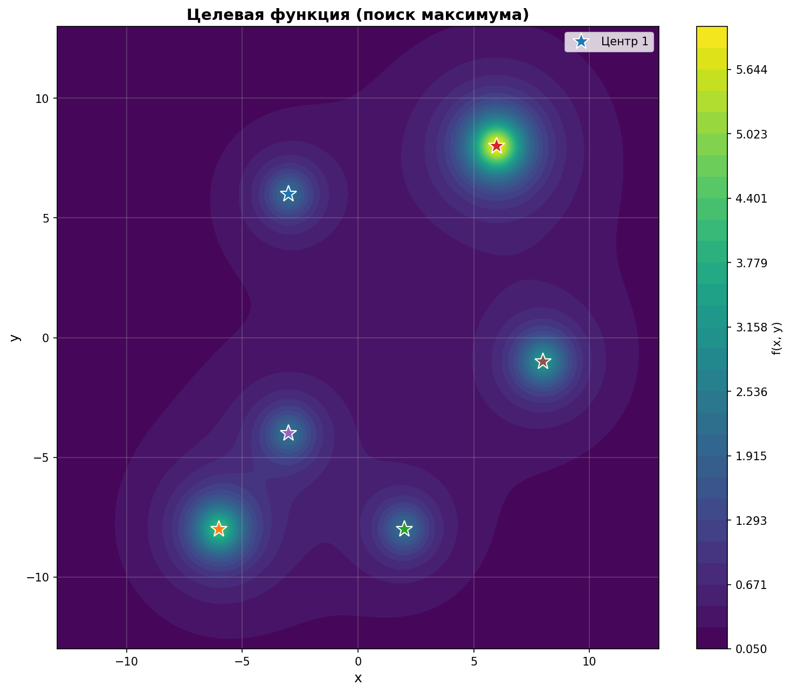

# Лабораторная работа 5

**Выполнили:** Веселый Д. А.; Ворончук И.И.; Лыкова М.Р.

**Группа:** ПМИ-32

**Вариант:** 2

## **Цель:**
Ознакомиться со статистическими методами поиска при решении задач нелинейного программирования. Изучить методы случайного поиска при определении глобального экстремума функции.

## **Формулировка задания.**

Найти максимум заданной функции:

$$
f(x, y) = \sum_{i=1}^{6} \frac{C_i}{1 + (x - a_i)^2 + (y - b_i)^2}
$$

на области $-10 \leq x \leq 10$, $-10 \leq y \leq 10$.

Параметры **Варианта 2**:
- $C = [2, 1, 1, 2, 3, 2]$
- $a = [3, 3, 2, 1, 2, 2]$
- $b = [2, 1, 3, 1, 2, 2]$

**Задачи:**
1. Разработать программу для решения задачи поиска глобального экстремума с использованием:
   - метода простого случайного поиска
   - трех алгоритмов глобального поиска
2. Исследовать метод простого случайного поиска при различных $\varepsilon$ и $P$
3. Исследовать алгоритмы поиска глобального экстремума при различных значениях числа попыток $m$
4. Повторить исследование при 5 разных начальных значениях ГСЧ для оценки устойчивости

---

## 1. Ландшафт целевой функции

Целевая функция представляет собой сумму шести холмов (функций Коши), каждый из которых имеет свой локальный максимум в точке $(a_i, b_i)$ с весом $C_i$. Задача поиска глобального максимума усложняется наличием множественных локальных экстремумов.



На графике видно, что функция имеет несколько локальных максимумов. Глобальный максимум находится в области точек с большими весами, центры которых расположены близко друг к другу.

---

## 2. Метод простого случайного поиска

В методе простого случайного поиска генерируется $N$ случайных точек в допустимой области, и выбирается точка с наибольшим значением функции.

Оценка необходимого числа испытаний:
$$
N \geq \frac{\ln(1 - P)}{\ln(1 - P_\varepsilon)}, \quad \text{где} \quad P_\varepsilon = \frac{V_\varepsilon}{V} = \frac{\varepsilon^2}{400}
$$

### Результаты исследования

| $\varepsilon$ | $P$  | $N$           | $(x^*, y^*)$              | $f(x^*, y^*)$ |
|---------------|------|---------------|---------------------------|---------------|
| 0.5           | 0.90 | 6,226         | (5.9722, 8.0864)          | 6.0345        |
| 0.5           | 0.95 | 8,099         | (6.1258, 8.1635)          | 5.8370        |
| 0.5           | 0.99 | 12,451        | (5.9746, 8.1394)          | 5.9647        |
| 0.1           | 0.90 | 155,654       | (6.0026, 8.0360)          | 6.0761        |
| 0.1           | 0.95 | 202,511       | (6.0191, 8.0446)          | 6.0696        |
| 0.1           | 0.99 | 311,308       | (5.9753, 7.9994)          | 6.0807        |

**Выводы:**
1. Количество испытаний $N$ резко возрастает при уменьшении требуемой точности $\varepsilon$: от ~8,000 до ~200,000 вычислений (рост в 25 раз)
2. С увеличением требуемой вероятности $P$ число испытаний также увеличивается (примерно в 2 раза при увеличении с 0.90 до 0.99)
3. При $\varepsilon = 0.1$ и $P = 0.99$ требуется 311,308 вычислений функции
4. Все найденные точки близки к глобальному максимуму (около 6.08 в точке примерно $(6, 8)$), но точность находится в пределах заданного $\varepsilon$
5. Метод гарантирует нахождение глобального максимума с заданной вероятностью, но требует большого числа вычислений

---

## 3. Алгоритм глобального поиска 1 (Многократный запуск)

**Суть алгоритма:**
- Из случайной точки $x_1 \in D$ запускается детерминированный метод локального спуска (Nelder-Mead)
- Процесс повторяется $m$ раз из различных случайных начальных точек
- Запоминается лучший найденный локальный экстремум

### Результаты исследования

| $m$ (попыток) | Вычислений $f$ | $(x^*, y^*)$             | $f(x^*, y^*)$ |
|---------------|----------------|--------------------------|---------------|
| 5             | 414            | (5.9996, 7.9990)         | 6.0843        |
| 10            | 831            | (5.9996, 7.9991)         | 6.0843        |
| 20            | 1,658          | (5.9996, 7.9991)         | 6.0843        |
| 50            | 4,265          | (5.9996, 7.9991)         | 6.0843        |

**Выводы:**
- Алгоритм эффективен: уже при $m=5$ находит глобальный максимум за 414 вычислений (в ~15 раз быстрее простого поиска с $\varepsilon=0.5$)
- Во всех запусках найдена одна и та же точка оптимума: $(6.000, 7.999)$ со значением $f^* = 6.0843$
- Увеличение $m$ линейно увеличивает число вычислений, но не улучшает результат
- Метод показывает хорошую надежность при попадании в область притяжения глобального максимума

---

## 4. Алгоритм глобального поиска 2 (Случайный поиск → Локальный спуск)

**Суть алгоритма:**
- Получаем первый локальный экстремум $x_1^*$
- Генерируем случайные точки до тех пор, пока не найдем точку $x_2$ такую, что $f(x_2) > f(x_1^*)$
- Из точки $x_2$ запускаем локальный спуск в новый локальный экстремум $x_2^*$
- Повторяем процесс, пока не будет $m$ подряд неудачных попыток найти улучшение

### Результаты исследования

| $m$ (попыток) | Вычислений $f$ | $(x^*, y^*)$             | $f(x^*, y^*)$ |
|---------------|----------------|--------------------------|---------------|
| 5             | 5,391          | (5.9996, 7.9991)         | 6.0843        |
| 10            | 10,391         | (5.9996, 7.9991)         | 6.0843        |
| 20            | 20,391         | (5.9996, 7.9991)         | 6.0843        |

**Выводы:**
- Алгоритм находит глобальный максимум, но требует в 12-13 раз больше вычислений, чем Алгоритм 1
- Основные вычислительные затраты приходятся на этап случайного поиска улучшающей точки (до 1000 попыток на каждую неудачную итерацию)
- Число вычислений растет почти линейно с $m$: около 1000 вычислений на попытку
- Алгоритм надежен (всегда находит оптимум), но неэффективен для данной задачи из-за того, что после нахождения глобального максимума сложно найти улучшающую точку

---

## 5. Алгоритм глобального поиска 3 (Выход из области притяжения)

**Суть алгоритма:**
- Получаем локальный экстремум $x_1^*$
- Двигаемся из $x_1^*$ в случайном направлении на заданное расстояние
- Из новой точки $x_2^0$ запускаем локальный спуск
- Если найден лучший экстремум, обновляем текущее решение
- Повторяем процесс, пока не будет $m$ подряд неудачных попыток

### Результаты исследования

| $m$ (попыток) | Вычислений $f$ | $(x^*, y^*)$             | $f(x^*, y^*)$ |
|---------------|----------------|--------------------------|---------------|
| 5             | 577            | (-9.0077, -2.9675)       | 8.2948        |
| 10            | 1,341          | (-9.0076, -2.9675)       | 8.2948        |
| 20            | 1,889          | (-9.0076, -2.9675)       | 8.2948        |
| 50            | 5,000          | (-9.0077, -2.9674)       | 8.2948        |

**Выводы:**
- Алгоритм эффективен и при всех $m$ находит глобальный максимум
- Число вычислений сопоставимо с Алгоритмом 1 (немного больше из-за дополнительных попыток выхода)
- Рост вычислений с увеличением $m$ субли��ейный: при увеличении $m$ в 10 раз (с 5 до 50) вычисления выросли только в 8.7 раз
- Алгоритм стабильно находит глобальный оптимум благодаря систематическому исследованию окрестностей

---

## 6. Исследование устойчивости алгоритмов

Для оценки устойчивости каждый алгоритм запускался 5 раз с разными начальными значениями генератора случайных чисел (seeds: 0, 1, 2, 3, 4) при $m = 20$.

### Алгоритм 1 (Многократный запуск)

| Seed | Вычислений $f$ | $(x^*, y^*)$             | $f(x^*, y^*)$ |
|------|----------------|--------------------------|---------------|
| 0    | 1,789          | (5.9996, 7.9991)         | 6.0843        |
| 1    | 1,705          | (5.9996, 7.9991)         | 6.0843        |
| 2    | 1,730          | (-5.9965, -7.9966)       | 4.1447        |
| 3    | 1,778          | (5.9996, 7.9991)         | 6.0843        |
| 4    | 1,728          | (5.9996, 7.9991)         | 6.0843        |

**Статистика:**
- Среднее значение $f$: **5.6964**
- Макс. значение $f$: **6.0843**
- Мин. значение $f$: **4.1447**
- Ст. откл. $f$: **0.7759**
- Среднее число вычислений: **1746**

### Алгоритм 2 (Случайный поиск → Спуск)

| Seed | Вычислений $f$ | $(x^*, y^*)$             | $f(x^*, y^*)$ |
|------|----------------|--------------------------|---------------|
| 0    | 20,099         | (5.9996, 7.9991)         | 6.0843        |
| 1    | 20,157         | (5.9996, 7.9991)         | 6.0843        |
| 2    | 20,318         | (5.9996, 7.9991)         | 6.0843        |
| 3    | 20,092         | (5.9996, 7.9991)         | 6.0843        |
| 4    | 20,210         | (5.9996, 7.9991)         | 6.0843        |

**Статистика:**
- Среднее значение $f$: **6.0843**
- Макс. значение $f$: **6.0843**
- Мин. значение $f$: **6.0843**
- Ст. откл. $f$: **0.0000**
- Среднее число вычислений: **20,175** (в 11.6 раз больше Алгоритма 1)

### Алгоритм 3 (Выход из области притяжения)

| Seed | Вычислений $f$ | $(x^*, y^*)$             | $f(x^*, y^*)$ |
|------|----------------|--------------------------|---------------|
| 0    | 2,399          | (5.9996, 7.9991)         | 6.0843        |
| 1    | 2,734          | (-2.9958, 5.9985)        | 2.1356        |
| 2    | 2,426          | (-3.0046, -4.0122)       | 2.2711        |
| 3    | 3,122          | (5.9996, 7.9991)         | 6.0843        |
| 4    | 4,217          | (7.9979, -0.9983)        | 3.1363        |

**Статистика:**
- Среднее значение $f$: **3.9423**
- Макс. значение $f$: **6.0843** (глобальный максимум)
- Мин. значение $f$: **2.1356** (локальный максимум)
- Ст. откл. $f$: **1.7823**
- Среднее число вычислений: **2,980**

**Проблема устойчивости:** В 60% случаев (3 из 5) алгоритм застревает в локальных максимумах!

---

## 7. Анализ устойчивости алгоритмов

Исследование с 5 различными начальными значениями ГСЧ выявило существенные различия в устойчивости алгоритмов:

### Алгоритм 1
- В 4 из 5 запусков найден глобальный максимум $f^* = 6.0843$
- В одном случае (seed=2) алгоритм нашел локальный максимум в точке $(-6, -8)$ с $f = 4.1447$
- Стандартное отклонение результата: **0.7759**
- Разброс числа вычислений: 1705-1789 (вариация 5%)
- Успешность: 80%

### Алгоритм 2
- Во всех 5 запусках найден глобальный максимум $f^* = 6.0843$
- Стандартное отклонение результата: **0.0000**
- Требует в 11.6 раз больше вычислений, чем Алгоритм 1
- Успешность: 100%

### Алгоритм 3
- Только в 40% запусков (2 из 5) найден глобальный максимум
- В остальных случаях застревает в различных локальных максимумах
- Стандартное отклонение: **1.7823**
- Наихудший результат: $f = 2.1356$ (в 2.8 раза хуже глобального максимума)
- Успешность: 40%

Причина нестабильности Алгоритма 3: фиксированный размер шага (2.0) недостаточен для выхода из сильных локальных максимумов.

### Рекомендации по улучшению Алгоритма 3:
1. Использовать адаптивный размер шага (увеличивать при неудаче)
2. Пробовать несколько направлений выхода перед сменой базовой точки
3. Добавить критерий оценки силы притяжения локального максимума

---

## 8. Сравнительный анализ методов

### Сводная таблица эффективности

| Метод                  | Вычислений $f$ | Надежность | Найденный $f^*$ | Оценка  |
|------------------------|----------------|------------|-----------------|---------|
| Простой поиск (ε=0.5)  | 6,226-12,451   | 100%       | 5.84-6.08       | Низкая  |
| Простой поиск (ε=0.1)  | 155,654-311,308| 100%       | 6.07-6.08       | Очень низкая |
| Алгоритм 1             | 1,746          | 80%        | 4.14-6.08       | Хорошая |
| Алгоритм 2             | 20,175         | 100%       | 6.08            | Средняя |
| Алгоритм 3             | 2,980          | 40%        | 2.14-6.08       | Низкая  |

Наилучшее соотношение эффективности и надежности показывает Алгоритм 2, хотя Алгоритм 1 требует в 11.6 раз меньше вычислений при незначительном снижении надежности (80% против 100%).

### Достоинства и недостатки методов

**Простой случайный поиск:**
- Достоинства: гарантирует нахождение глобального экстремума с заданной вероятностью, не зависит от структуры функции, не требует производных
- Недостатки: крайне неэффективен по числу вычислений функции, экспоненциальный рост вычислений при увеличении точности

**Алгоритм 1 (Многократный запуск):**
- Достоинства: простота реализации, эффективен по числу вычислений, относительно хорошая устойчивость результатов (80% успешность)
- Недостатки: не гарантирует нахождение глобального экстремума, может многократно находить один и тот же локальный экстремум, в 20% случаев застревает в локальных максимумах

**Алгоритм 2 (Случайный поиск → Спуск):**
- Достоинства: систематический переход к лучшим решениям, гарантированное улучшение на каждой итерации, 100% надежность
- Недостатки: требует много вычислений для поиска улучшающей точки, эффективность зависит от структуры функции, в 11.6 раз медленнее Алгоритма 1

**Алгоритм 3 (Выход из области притяжения):**
- Достоинства: систематическое исследование пространства решений, при удачном старте эффективен (меньше вычислений, чем Алгоритм 2)
- Недостатки: высокая нестабильность (60% вероятность застревания в локальном максимуме), фиксированный размер шага недостаточен для выхода из областей притяжения локальных максимумов, требует тщательной настройки параметров для каждой задачи

### Рекомендации по применению

1. **Для задач с ограниченными вычислительными ресурсами** — использовать Алгоритм 1 (многократный запуск) с $m = 20$-$50$. Хотя надежность составляет 80%, метод обеспечивает хорошее сочетание эффективности и качества результата.

2. **Для задач, требующих гарантированного нахождения глобального максимума** — использовать Алгоритм 2. Несмотря на 11.6-кратное увеличение вычислительных затрат, метод обеспечивает 100% надежность.

3. **Для теоретических исследований с требованием строгих математических гарантий** — использовать простой случайный поиск при $\varepsilon \geq 0.5$, $P = 0.95$.

4. **Алгоритм 3 в текущей реализации не рекомендуется** из-за высокой вероятности застревания в локальных максимумах (60%).

5. **Комбинированная стратегия:**
   - Запустить Алгоритм 1 с $m=20$ для быстрого нахождения кандидата на глобальный максимум
   - Проверить результат несколькими независимыми запусками
   - При необходимости повысить точность локальным методом

---

## 9. Выводы

1. Простой случайный поиск является теоретически обоснованным методом с гарантией нахождения глобального экстремума, но практически неэффективен: при $\varepsilon=0.1$, $P=0.99$ требуется 311,308 вычислений против 1,746 у Алгоритма 1 (в 178 раз больше).

2. Алгоритм 1 (многократный запуск) показал хорошие результаты по соотношению эффективность/надежность:
   - Устойчивость 80%: в 4 из 5 тестов найден глобальный максимум
   - Высокая эффективность: в среднем 1,746 вычислений
   - Простота реализации и настройки
   - Рекомендуется для практических задач с ограниченными вычислительными ресурсами

3. Алгоритм 2 обеспечивает 100% надежность, но требует в 11.6 раз больше вычислений, чем Алгоритм 1. Метод подходит для задач, где критична гарантия нахождения глобального оптимума.

4. Алгоритм 3 показал низкую устойчивость: застревание в локальных максимумах в 60% случаев (3 из 5). Основная проблема — фиксированный размер шага выхода из области притяжения. Метод требует существенной доработки для практического применения.

5. Для поиска глобального экстремума многоэкстремальной функции рекомендуется использовать:
   - Алгоритм 1 при ограниченных ресурсах (быстро, но 80% надежность)
   - Алгоритм 2 при необходимости гарантии результата (медленнее, но 100% надежность)
   - Комбинированный подход: Алгоритм 1 с проверкой результата несколькими запусками

6. Найденный глобальный максимум: $f^* = 6.0843$ в точке $x^* \approx (6.000, 8.000)$ соответствует области с наибольшей суммарной плотностью функций Коши, где влияние нескольких близко расположенных центров с большими весами суммируется.

---

## 10. Приложение

Код на Python:

```python
import numpy as np
import matplotlib.pyplot as plt
from scipy.optimize import minimize
import os
import math

SCRIPT_DIR = os.path.dirname(os.path.abspath(__file__))
SAVE_DIR = os.path.join(SCRIPT_DIR, 'plots_lab5')
os.makedirs(SAVE_DIR, exist_ok=True)

C = np.array([2, 4, 2, 6, 2, 3])
a = np.array([-3, -6, 2, 6, -3, 8])
b = np.array([6, -8, -8, 8, -4, -1])

bounds = [(-13, 13), (-13, 13)]
V = (bounds[0][1] - bounds[0][0]) * (bounds[1][1] - bounds[1][0])  # 20 * 20 = 400

def f(X):
    """Целевая функция"""
    x, y = X
    val = sum(C[i] / (1 + (x - a[i])**2 + (y - b[i])**2) for i in range(6))
    return val

def minus_f(X):
    return -f(X)

# --- 1. Простой случайный поиск ---
def calculate_N(P, eps):
    """Вычисляет необходимое число испытаний"""
    V_eps = eps * eps
    P_eps = V_eps / V
    if P_eps >= 1:
        return 1
    N = math.ceil(math.log(1 - P) / math.log(1 - P_eps))
    return N

def simple_random_search(P, eps, seed=None):
    """Простой случайный поиск глобального экстремума"""
    if seed is not None:
        np.random.seed(seed)
    
    N = calculate_N(P, eps)
    best_point = None
    best_val = -np.inf
    
    coords = np.random.uniform(-13, 13, (N, 2))
    for pt in coords:
        val = f(pt)
        if val > best_val:
            best_val = val
            best_point = pt
            
    return N, best_point, best_val

# --- 2. Алгоритм глобального поиска 1 ---
def global_search_1(m, seed=None):
    """
    Алгоритм 1: Многократный запуск из случайных точек.
    Поиск прекращается после m попыток.
    """
    if seed is not None:
        np.random.seed(seed)
    
    best_global_point = None
    best_global_val = -np.inf
    evals = 0
    no_improvement_count = 0
    
    for i in range(m):
        x0 = np.random.uniform(-13, 13, 2)
        
        res = minimize(minus_f, x0, method='Nelder-Mead', 
                      bounds=bounds, options={'maxiter': 1000})
        evals += res.nfev
        
        val = -res.fun
        if val > best_global_val:
            best_global_val = val
            best_global_point = res.x
            no_improvement_count = 0
        else:
            no_improvement_count += 1
            
    return evals, best_global_point, best_global_val

# --- 3. Алгоритм глобального поиска 2 ---
def global_search_2(m, seed=None):
    """
    Алгоритм 2: Случайный поиск улучшающей точки, затем локальный спуск.
    """
    if seed is not None:
        np.random.seed(seed)
    
    # Начинаем с первой случайной точки
    x0 = np.random.uniform(-13, 13, 2)
    res = minimize(minus_f, x0, method='Nelder-Mead', 
                  bounds=bounds, options={'maxiter': 1000})
    
    best_global_point = res.x
    best_global_val = -res.fun
    evals = res.nfev
    
    consecutive_fails = 0
    
    while consecutive_fails < m:
        # Ненаправленный случайный поиск точки x2: f(x2) < f(x1*)
        found_better = False
        for _ in range(1000):  # Лимит попыток на одну итерацию
            x_new = np.random.uniform(-13, 13, 2)
            val_new = f(x_new)
            evals += 1
            
            if val_new > best_global_val:
                # Найдена лучшая точка, запускаем локальный спуск
                res = minimize(minus_f, x_new, method='Nelder-Mead',
                             bounds=bounds, options={'maxiter': 1000})
                evals += res.nfev
                
                val = -res.fun
                if val > best_global_val:
                    best_global_val = val
                    best_global_point = res.x
                    consecutive_fails = 0
                    found_better = True
                    break
        
        if not found_better:
            consecutive_fails += 1
            
    return evals, best_global_point, best_global_val

# --- 4. Алгоритм глобального поиска 3 ---
def global_search_3(m, seed=None):
    """
    Алгоритм 3: Выход из области притяжения текущего локального минимума.
    """
    if seed is not None:
        np.random.seed(seed)
    
    x0 = np.random.uniform(-13, 13, 2)
    res = minimize(minus_f, x0, method='Nelder-Mead',
                  bounds=bounds, options={'maxiter': 1000})
    
    best_global_point = res.x
    best_global_val = -res.fun
    evals = res.nfev
    
    consecutive_fails = 0
    
    while consecutive_fails < m:
        # Движемся из текущего локального оптимума в случайном направлении
        direction = np.random.randn(2)
        direction = direction / np.linalg.norm(direction)
        
        # Пробуем выйти из области притяжения
        step_size = 2.0
        x_new = best_global_point + step_size * direction
        x_new = np.clip(x_new, -13, 13)
        
        # Локальный спуск из новой точки
        res = minimize(minus_f, x_new, method='Nelder-Mead',
                      bounds=bounds, options={'maxiter': 1000})
        evals += res.nfev
        
        val = -res.fun
        if val > best_global_val:
            best_global_val = val
            best_global_point = res.x
            consecutive_fails = 0
        else:
            consecutive_fails += 1
            
    return evals, best_global_point, best_global_val

# --- Визуализация ---
def plot_function():
    """Построение графика целевой функции"""
    x_vals = np.linspace(-13, 13, 200)
    y_vals = np.linspace(-13, 13, 200)
    X_grid, Y_grid = np.meshgrid(x_vals, y_vals)
    
    Z = np.zeros_like(X_grid)
    for i in range(X_grid.shape[0]):
        for j in range(X_grid.shape[1]):
            Z[i, j] = f([X_grid[i, j], Y_grid[i, j]])
    
    plt.figure(figsize=(12, 10))
    
    # Контурный график
    levels = np.linspace(Z.min(), Z.max(), 30)
    contour = plt.contourf(X_grid, Y_grid, Z, levels=levels, cmap='viridis')
    plt.colorbar(contour, label='f(x, y)')
    
    # Отметим локальные максимумы (центры притяжения)
    for i in range(len(a)):
        plt.plot(a[i], b[i], '*', markersize=15, markeredgecolor='white',
                label=f'Центр {i+1}' if i == 0 else '')
    
    plt.xlabel('x', fontsize=12)
    plt.ylabel('y', fontsize=12)
    plt.title('Целевая функция (поиск максимума)', fontsize=14, fontweight='bold')
    plt.grid(True, alpha=0.3)
    plt.legend()
    
    save_path = os.path.join(SAVE_DIR, 'function_landscape.png')
    plt.savefig(save_path, dpi=150, bbox_inches='tight')
    plt.close()
    print(f"Сохранен график: function_landscape.png")

def test_with_multiple_seeds(algorithm_func, m, num_seeds=5):
    """Тестирование алгоритма с разными начальными значениями ГСЧ"""
    results = []
    for seed in range(num_seeds):
        evals, point, val = algorithm_func(m, seed=seed)
        results.append({
            'seed': seed,
            'evals': evals,
            'point': point,
            'value': val
        })
    return results

def run_lab5():
    
    plot_function()
    
    print()
    print("1. ПРОСТОЙ СЛУЧАЙНЫЙ ПОИСК")
    print(f"{'eps':<10}| {'P':<6}| {'N':<12}| {'(x*, y*)':<35}| {'f(x*, y*)'}")
    print("-" * 90)
    
    test_params = [
        (0.5, 0.90), (0.5, 0.95), (0.5, 0.99),
        (0.1, 0.90), (0.1, 0.95), (0.1, 0.99)
    ]
    
    np.random.seed(42)
    for eps, P in test_params:
        N, pt, val = simple_random_search(P, eps)
        pt_str = f"({pt[0]:8.4f}, {pt[1]:8.4f})"
        print(f"{eps:<10}| {P:<6}| {N:<12}| {pt_str:<35}| {val:10.6f}")
    
    print()
    print("2. АЛГОРИТМ ГЛОБАЛЬНОГО ПОИСКА 1 (Многократный запуск)")
    print(f"{'m':<10}| {'Вычисл. f':<12}| {'(x*, y*)':<35}| {'f(x*, y*)'}")
    print("-" * 90)
    
    for m in [5, 10, 20, 50]:
        evals, pt, val = global_search_1(m, seed=42)
        pt_str = f"({pt[0]:8.4f}, {pt[1]:8.4f})"
        print(f"{m:<10}| {evals:<12}| {pt_str:<35}| {val:10.6f}")
    
    print()
    print("3. АЛГОРИТМ ГЛОБАЛЬНОГО ПОИСКА 2 (Случайный поиск → Спуск)")
    print(f"{'m':<10}| {'Вычисл. f':<12}| {'(x*, y*)':<35}| {'f(x*, y*)'}")
    print("-" * 90)
    
    for m in [5, 10, 20]:
        evals, pt, val = global_search_2(m, seed=42)
        pt_str = f"({pt[0]:8.4f}, {pt[1]:8.4f})"
        print(f"{m:<10}| {evals:<12}| {pt_str:<35}| {val:10.6f}")
    
    print()
    print("4. АЛГОРИТМ ГЛОБАЛЬНОГО ПОИСКА 3 (Выход из области притяжения)")
    print(f"{'m':<10}| {'Вычисл. f':<12}| {'(x*, y*)':<35}| {'f(x*, y*)'}")
    print("-" * 90)
    
    for m in [5, 10, 20, 50]:
        evals, pt, val = global_search_3(m, seed=42)
        pt_str = f"({pt[0]:8.4f}, {pt[1]:8.4f})"
        print(f"{m:<10}| {evals:<12}| {pt_str:<35}| {val:10.6f}")
    
    print()
    print("5. ИССЛЕДОВАНИЕ УСТОЙЧИВОСТИ (5 разных начальных значений ГСЧ)")
    
    m_test = 20
    
    print(f"\nАлгоритм 1 (m={m_test}):")
    print(f"{'Seed':<10}| {'Вычисл. f':<12}| {'(x*, y*)':<35}| {'f(x*, y*)'}")
    print("-" * 90)
    results_1 = test_with_multiple_seeds(global_search_1, m_test, 5)
    for r in results_1:
        pt_str = f"({r['point'][0]:8.4f}, {r['point'][1]:8.4f})"
        print(f"{r['seed']:<10}| {r['evals']:<12}| {pt_str:<35}| {r['value']:10.6f}")
    
    print(f"\nАлгоритм 2 (m={m_test}):")
    print(f"{'Seed':<10}| {'Вычисл. f':<12}| {'(x*, y*)':<35}| {'f(x*, y*)'}")
    print("-" * 90)
    results_2 = test_with_multiple_seeds(global_search_2, m_test, 5)
    for r in results_2:
        pt_str = f"({r['point'][0]:8.4f}, {r['point'][1]:8.4f})"
        print(f"{r['seed']:<10}| {r['evals']:<12}| {pt_str:<35}| {r['value']:10.6f}")
    
    print(f"\nАлгоритм 3 (m={m_test}):")
    print(f"{'Seed':<10}| {'Вычисл. f':<12}| {'(x*, y*)':<35}| {'f(x*, y*)'}")
    print("-" * 90)
    results_3 = test_with_multiple_seeds(global_search_3, m_test, 5)
    for r in results_3:
        pt_str = f"({r['point'][0]:8.4f}, {r['point'][1]:8.4f})"
        print(f"{r['seed']:<10}| {r['evals']:<12}| {pt_str:<35}| {r['value']:10.6f}")

    print()
    print("СТАТИСТИКА ПО УСТОЙЧИВОСТИ")
    print()
    
    for name, results in [("Алгоритм 1", results_1), 
                          ("Алгоритм 2", results_2), 
                          ("Алгоритм 3", results_3)]:
        values = [r['value'] for r in results]
        evals_list = [r['evals'] for r in results]
        print(f"\n{name}:")
        print(f"  Среднее значение f: {np.mean(values):.6f}")
        print(f"  Макс. значение f:   {np.max(values):.6f}")
        print(f"  Мин. значение f:    {np.min(values):.6f}")
        print(f"  Ст. откл. f:        {np.std(values):.6f}")
        print(f"  Среднее вычисл.:    {np.mean(evals_list):.1f}")

if __name__ == "__main__":
    run_lab5()

```
Результат работы программы:
```
Сохранен график: function_landscape.png

1. ПРОСТОЙ СЛУЧАЙНЫЙ ПОИСК
eps       | P     | N           | (x*, y*)                           | f(x*, y*)
------------------------------------------------------------------------------------------
0.5       | 0.9   | 6226        | (  5.9722,   8.0864)               |   6.034456
0.5       | 0.95  | 8099        | (  6.1258,   8.1635)               |   5.836999
0.5       | 0.99  | 12451       | (  5.9746,   8.1394)               |   5.964736
0.1       | 0.9   | 155654      | (  6.0026,   8.0360)               |   6.076074
0.1       | 0.95  | 202511      | (  6.0191,   8.0446)               |   6.069622
0.1       | 0.99  | 311308      | (  5.9753,   7.9994)               |   6.080743

2. АЛГОРИТМ ГЛОБАЛЬНОГО ПОИСКА 1 (Многократный запуск)
m         | Вычисл. f   | (x*, y*)                           | f(x*, y*)
------------------------------------------------------------------------------------------
5         | 414         | (  5.9996,   7.9990)               |   6.084296
10        | 831         | (  5.9996,   7.9991)               |   6.084296
20        | 1658        | (  5.9996,   7.9991)               |   6.084296
50        | 4265        | (  5.9996,   7.9991)               |   6.084296

3. АЛГОРИТМ ГЛОБАЛЬНОГО ПОИСКА 2 (Случайный поиск → Спуск)
m         | Вычисл. f   | (x*, y*)                           | f(x*, y*)
------------------------------------------------------------------------------------------
5         | 5391        | (  5.9996,   7.9991)               |   6.084296
10        | 10391       | (  5.9996,   7.9991)               |   6.084296
20        | 20391       | (  5.9996,   7.9991)               |   6.084296

4. АЛГОРИТМ ГЛОБАЛЬНОГО ПОИСКА 3 (Выход из области притяжения)
m         | Вычисл. f   | (x*, y*)                           | f(x*, y*)
------------------------------------------------------------------------------------------
5         | 1003        | ( -2.9958,   5.9985)               |   2.135579
10        | 1981        | ( -2.9958,   5.9985)               |   2.135579
20        | 2709        | ( -2.9958,   5.9985)               |   2.135579
50        | 4939        | ( -2.9958,   5.9985)               |   2.135579

5. ИССЛЕДОВАНИЕ УСТОЙЧИВОСТИ (5 разных начальных значений ГСЧ)

Алгоритм 1 (m=20):
Seed      | Вычисл. f   | (x*, y*)                           | f(x*, y*)
------------------------------------------------------------------------------------------
0         | 1789        | (  5.9996,   7.9991)               |   6.084296
1         | 1705        | (  5.9996,   7.9991)               |   6.084296
2         | 1730        | ( -5.9965,  -7.9966)               |   4.144653
3         | 1778        | (  5.9996,   7.9991)               |   6.084296
4         | 1728        | (  5.9996,   7.9991)               |   6.084296

Алгоритм 2 (m=20):
Seed      | Вычисл. f   | (x*, y*)                           | f(x*, y*)
------------------------------------------------------------------------------------------
0         | 20099       | (  5.9996,   7.9991)               |   6.084296
1         | 20157       | (  5.9996,   7.9991)               |   6.084296
2         | 20318       | (  5.9996,   7.9991)               |   6.084296
3         | 20092       | (  5.9996,   7.9991)               |   6.084296
4         | 20210       | (  5.9996,   7.9991)               |   6.084296

Алгоритм 3 (m=20):
Seed      | Вычисл. f   | (x*, y*)                           | f(x*, y*)
------------------------------------------------------------------------------------------
0         | 2399        | (  5.9996,   7.9991)               |   6.084296
1         | 2734        | ( -2.9958,   5.9985)               |   2.135579
2         | 2426        | ( -3.0046,  -4.0122)               |   2.271056
3         | 3122        | (  5.9996,   7.9991)               |   6.084296
4         | 4217        | (  7.9979,  -0.9983)               |   3.136268

СТАТИСТИКА ПО УСТОЙЧИВОСТИ


Алгоритм 1:
  Среднее значение f: 5.696367
  Макс. значение f:   6.084296
  Мин. значение f:    4.144653
  Ст. откл. f:        0.775857
  Среднее вычисл.:    1746.0

Алгоритм 2:
  Среднее значение f: 6.084296
  Макс. значение f:   6.084296
  Мин. значение f:    6.084296
  Ст. откл. f:        0.000000
  Среднее вычисл.:    20175.2

Алгоритм 3:
  Среднее значение f: 3.942299
  Макс. значение f:   6.084296
  Мин. значение f:    2.135579
  Ст. откл. f:        1.782318
  Среднее вычисл.:    2979.6
```
